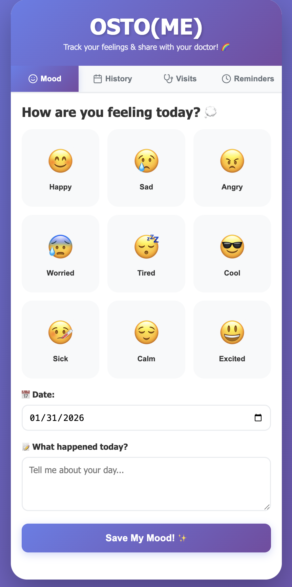
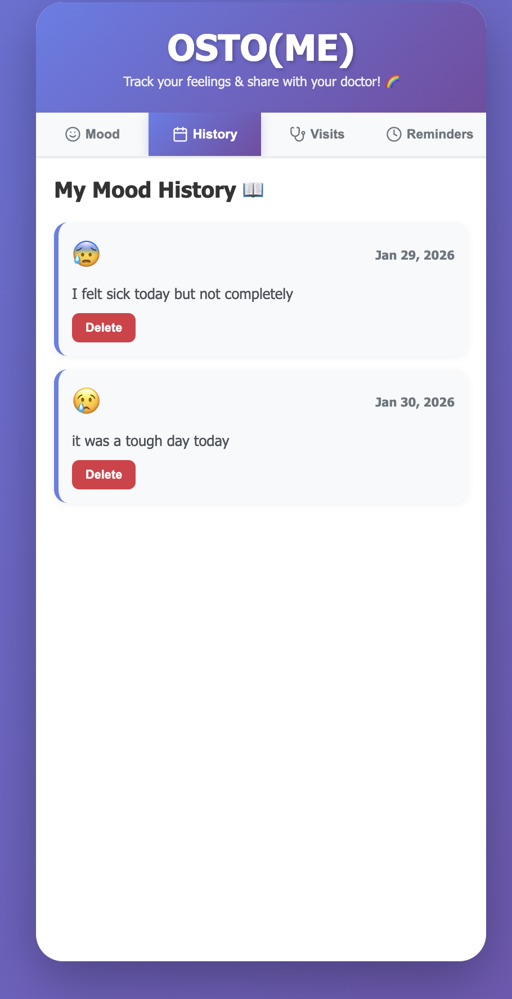

# OSTO(ME) - Child-Friendly Mood Tracking App 

A colorful, intuitive mood tracking application designed for children to track their feelings, symptoms, and appointments for doctor visits.

## Features

- **Mood Tracking**: Track daily moods with a fun emoji-based interface
- **Mood History**: View past mood entries with notes
- **Doctor Appointments**: Schedule and track upcoming doctor visits
- **Reminders**: Set reminders for medicine, exercise, and other important tasks
- **Child-Friendly Design**: Colorful, intuitive interface designed for kids
- **Local Storage**: All data is saved locally in the browser

## Live Demo

[View Live Demo](#) (https://visuxlize.github.io/ostome-app/)

## Screenshots




## Technologies Used

- **React 18** - UI Framework
- **Vite** - Build Tool
- **Lucide React** - Icon Library
- **CSS3** - Styling with gradients and animations
- **LocalStorage API** - Data persistence

## Prerequisites

Before you begin, ensure you have installed:
- [Node.js](https://nodejs.org/) (version 14 or higher)
- [npm](https://www.npmjs.com/) or [yarn](https://yarnpkg.com/)

## Installation

1. **Clone the repository**
   ```bash
   git clone https://github.com/visuxlize/ostome-app.git
   cd ostome-app
   ```

2. **Install dependencies**
   ```bash
   npm install
   ```

3. **Run the development server**
   ```bash
   npm run dev
   ```

4. **Open your browser**
   Navigate to `http://localhost:5173`

## Build for Production

```bash
npm run build
```

The build files will be in the `dist` folder.

## Deploy to GitHub Pages

1. **Update `vite.config.js`**
   Change the `base` to match your repository name:
   ```javascript
   base: '/ostome-app/'
   ```

2. **Build the project**
   ```bash
   npm run build
   ```

3. **Deploy to GitHub Pages**
   ```bash
   # Install gh-pages (one time)
   npm install -D gh-pages
   
   # Add to package.json scripts:
   "deploy": "gh-pages -d dist"
   
   # Deploy
   npm run deploy
   ```

4. **Enable GitHub Pages**
   - Go to your repository settings
   - Navigate to "Pages"
   - Select `gh-pages` branch
   - Your app will be live at `https://visuxlize.github.io/ostome-app/`

## 📱 Features Breakdown

### Mood Tracking
- 9 different mood options with emojis
- Date selection for each entry
- Notes section to describe the day
- Visual feedback with animations

### History View
- Chronological list of all mood entries
- Display mood emoji, date, and notes
- Delete individual entries
- Empty state for first-time users

### Appointments
- Add doctor visit details
- Include doctor name, date, and time
- Visual appointment cards
- Delete functionality

### Reminders
- Multiple reminder types (medicine, exercise, water, other)
- Set specific times for reminders
- Categorized with emoji indicators
- Easy deletion

## Design Philosophy

OSTO(ME) was designed with children in mind:
- **Bright, Cheerful Colors**: Purple gradient theme
- **Large Touch Targets**: Easy for small fingers
- **Clear Visual Feedback**: Animations and hover states
- **Simple Navigation**: Tab-based interface
- **Friendly Language**: Child-appropriate copy
- **Emoji-Heavy**: Visual communication over text

## Privacy & Data

- All data stored locally in browser's LocalStorage
- No server communication
- No user tracking
- Parents can clear data by clearing browser storage

## Contributing

Contributions are welcome! Please feel free to submit a Pull Request.

1. Fork the repository
2. Create your feature branch (`git checkout -b feature/AmazingFeature`)
3. Commit your changes (`git commit -m 'Add some AmazingFeature'`)
4. Push to the branch (`git push origin feature/AmazingFeature`)
5. Open a Pull Request

## License

This project is licensed under the MIT License.

##  Author

**Andres Marte**
- Portfolio: [visuxlize.github.io/portfolio](https://visuxlize.github.io/portfolio)
- LinkedIn: [linkedin.com/in/andres-marte-95438217b](https://linkedin.com/in/andres-marte-95438217b)
- GitHub: [@visuxlize](https://github.com/visuxlize)

##  Acknowledgments

- Design inspired by child psychology research on emotional expression
- Icons by [Lucide](https://lucide.dev/)
- Built as part of UX/UI portfolio project

## Support

If you have any questions or issues, please open an issue on GitHub.

---

Made with ❤️ for kids to better communicate their feelings
